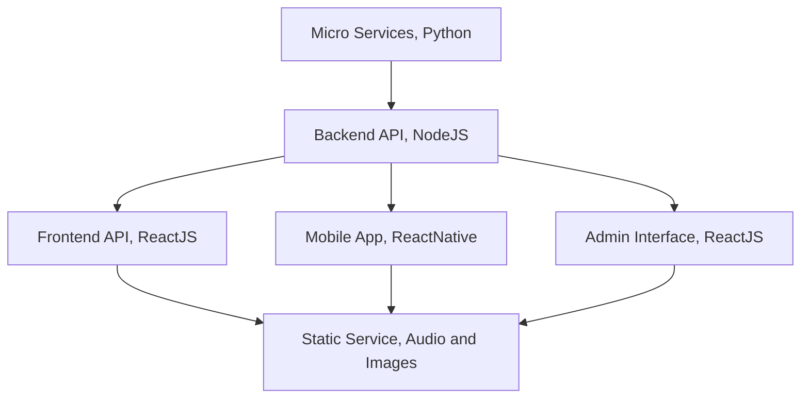

# Infrastructure

This graph indicates the technology stack used to build the OpenArabic.

The backend API written in NodeJS is connected to the microservices written in Python. The frontend API, mobile app, and admin interface are all written in ReactJS and ReactNative, respectively, and are connected to the backend API. The static service, which is used for storing audio and images, is connected to the frontend API, mobile app, and admin interface.

